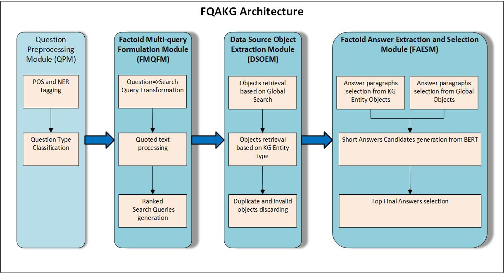

# nlp-question-answering
## Summary
This package implements an automated question-answering system, Factoid Question Answering using Knowledge Graph (FQAKG),
that leverages large Knowledge Graphs (KG) and Deep Learning techniques to identify concise answers to factoid-type
questions from any domain. The KG used for this system is Google KG – an online Web Service that provides API
for accessing Web data as structured entities. The Deep Learning system of choice is BERT – one of Google’s latest 
advancements in NLP. 

The FQAKG system is designed as pipeline of connected modules, each responsible for some processing:
1. QUESTION PRE-PROCESSING MODULE (QPM.py)
2. FACTOID MULTI-QUERY FORMULATION MODULE (FMQFM.py)
3. DATA SOURCE OBJECT EXTRACTION MODULE (DSOEM.py)
4. FACTOID ANSWER EXTRACTION AND SELECTION MODULE (FAESM.py)



## Installation
This package can be used in 2 ways: using docker or directly using python3.

### Using Python3
1. Ensure that you have python3 installed on your system.
2. Install prerequisites: ```sudo apt-get install libmysqlclient-dev```
3. Install following python packages: ```pip3 install word2number gitpython progressbar colorama pattern google-api-python-client requests_cache```
4. Install nltk: ```pip3 install --user -U nltk```
5. Download ntlk's stopwords and punkt data packages: see https://www.nltk.org/data.html.
6. Get this git repository
7. Run setup script: ```python3 setup_env.py```

### Using docker 
1. Ensure you have docker installed on your system
2. Download Dockerfile from this repository
3. Build docker image by running: "docker build -t nlp-question-answering ."
4. Run docker container by running: "docker run -it nlp-question-answering"

## Usage
The system is designed to provide learning experience for building Question Answering systems, by allowing to run 
individual modules of the Question Answering pipeline and improve or substitute them with others.
The module to run is specified via the parameter, as well as the question to be processed.
For example, to run 1st module of the pipeline, the following command can be used:
```
>python3 module_run.py --module=1 --question="How tall is Mount McKinley?"
```
For a list of available arguments, run:
```
>python3 module_run.py --help
```
